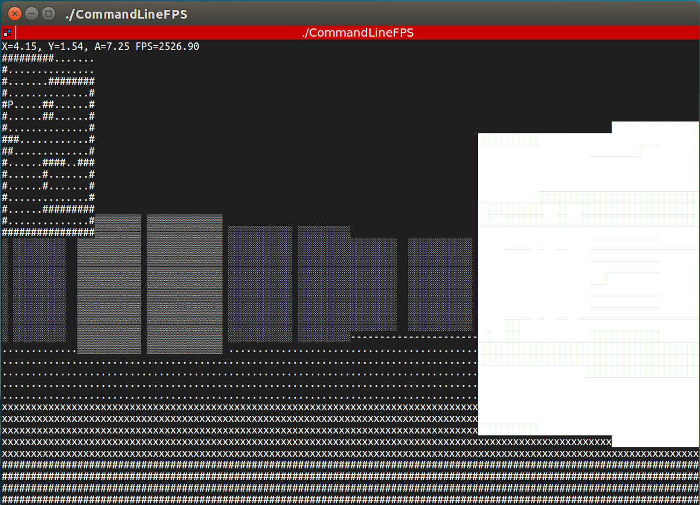

# CommandLineFPS - Linux Version


## Prerequisites

* CMake - C/C++ build system
* NCursesw - Library for interacting with the terminal

### Installation

* Ubuntu: `sudo apt-get install pkg-config libncursesw5-dev`
* Arch: `pacman -S pkg-config ncurses`
* Other distros: `¯\_(ツ)_/¯`

## Build

```sh
make
```

## Run

`./CommandLineFPS`


